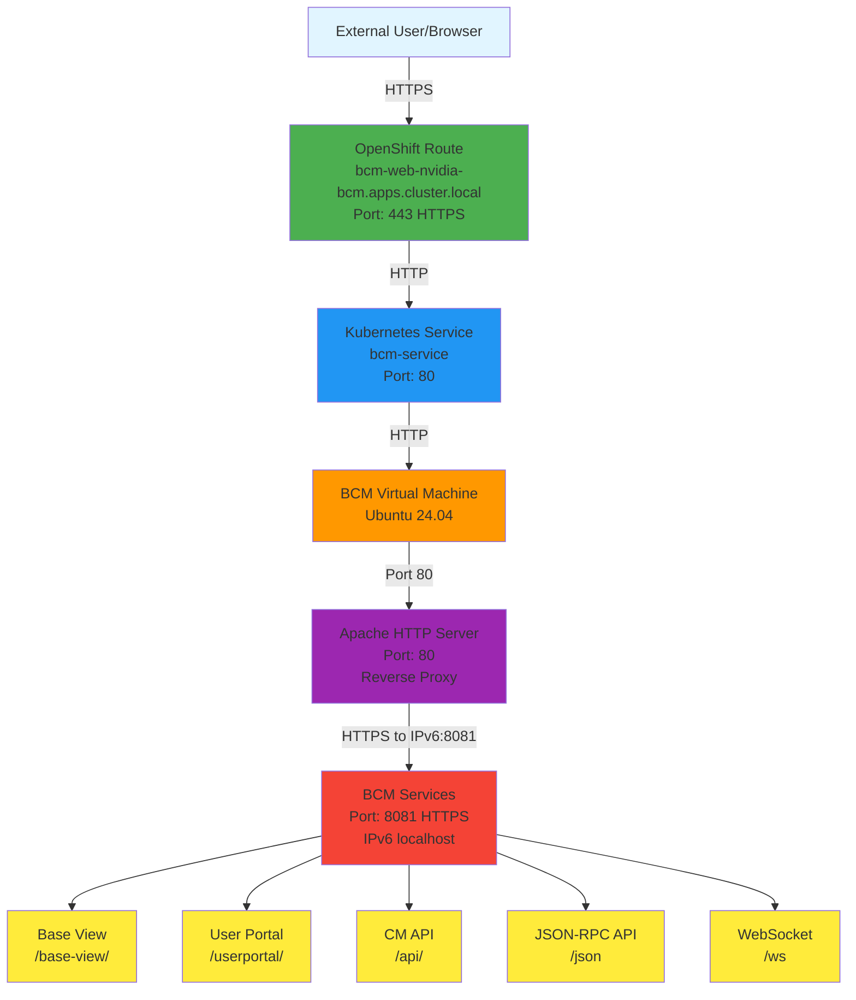
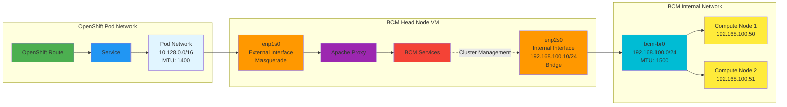
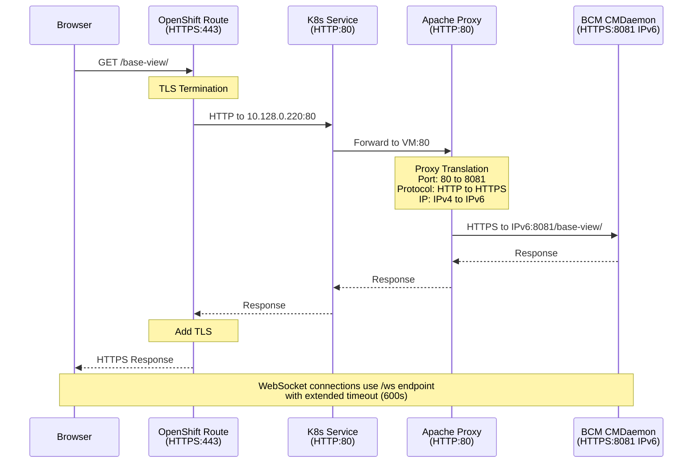

# Deploying NVIDIA Base Command Manager on OpenShift Virtualization: A Complete Guide

## Introduction

NVIDIA Base Command Manager (BCM) is a powerful cluster management platform designed for high-performance computing and AI workloads. While traditionally deployed on bare metal or conventional VMs, this guide demonstrates how to successfully deploy BCM v11.0 on OpenShift Virtualization (formerly KubeVirt), enabling cloud-native HPC infrastructure.

This deployment pattern is particularly valuable for organizations looking to:
- Modernize HPC infrastructure with Kubernetes
- Leverage existing OpenShift investments for AI/ML workloads
- Enable dynamic GPU resource management in containerized environments
- Simplify BCM deployment and lifecycle management

## Prerequisites

Before starting, ensure you have:

- **OpenShift Cluster**: Single-node or multi-node OpenShift 4.14+ cluster
- **Storage**: LVMS (Logical Volume Manager Storage) or ODF for persistent volumes
- **Resources**: At least 32GB RAM and 500GB storage for the BCM VM
- **BCM ISO**: Downloaded from NVIDIA Licensing Portal (bcm-11.0-ubuntu2404.iso)
- **CLI Tools**: 
  - `oc` (OpenShift CLI)
  - `virtctl` (KubeVirt CLI - installable via Homebrew on macOS)

## Architecture Overview

The final architecture consists of:



### Key Components

1. **OpenShift Route**: TLS termination and external access point
2. **Kubernetes Service**: Internal load balancer with VM endpoint
3. **BCM VM**: Ubuntu 24.04 running BCM head node
4. **Apache Reverse Proxy**: Bridges port 80 → 8081 and IPv4 → IPv6
5. **BCM Services**: Core cluster management services on port 8081

## Step 1: Install OpenShift Virtualization Operator

### 1.1 Install the Operator

Navigate to the OpenShift web console:

1. Go to **Operators** → **OperatorHub**
2. Search for "OpenShift Virtualization"
3. Click **Install**
4. Accept defaults and click **Install**

Or via CLI:

```bash
cat <<EOF | oc apply -f -
apiVersion: v1
kind: Namespace
metadata:
  name: openshift-cnv
---
apiVersion: operators.coreos.com/v1
kind: OperatorGroup
metadata:
  name: kubevirt-hyperconverged-group
  namespace: openshift-cnv
spec:
  targetNamespaces:
  - openshift-cnv
---
apiVersion: operators.coreos.com/v1alpha1
kind: Subscription
metadata:
  name: hco-operatorhub
  namespace: openshift-cnv
spec:
  source: redhat-operators
  sourceNamespace: openshift-marketplace
  name: kubevirt-hyperconverged
  startingCSV: kubevirt-hyperconverged-operator.v4.14.0
  channel: "stable"
EOF
```

### 1.2 Create HyperConverged Resource

```bash
cat <<EOF | oc apply -f -
apiVersion: hco.kubevirt.io/v1beta1
kind: HyperConverged
metadata:
  name: kubevirt-hyperconverged
  namespace: openshift-cnv
spec:
  featureGates:
    enableCommonBootImageImport: true
    deployKubeSecondaryDNS: true
EOF
```

### 1.3 Verify Installation

```bash
# Check operator status
oc get csv -n openshift-cnv

# Check HyperConverged status
oc get hco -n openshift-cnv kubevirt-hyperconverged

# Should show Ready: true
```

## Step 2: Configure Storage for Virtualization

### 2.1 Annotate Storage Class for Virtualization

For single-node deployments with LVMS:

```bash
# Check your storage class
oc get storageclass

# Annotate it for virtualization use
oc annotate storageclass lvms-nvme \
  storageclass.kubevirt.io/is-default-virt-class="true"
```

**Note**: The warning about lack of RWX (ReadWriteMany) support is expected and acceptable for single-node deployments since live migration requires multiple nodes anyway.

## Step 3: Create BCM Network Configuration

BCM requires two network interfaces:
- **External network**: For web UI and external access
- **Internal network**: For BCM ↔ Compute node communication



### 3.1 Create Internal Network

```bash
cat <<EOF | oc apply -f -
apiVersion: k8s.cni.cncf.io/v1
kind: NetworkAttachmentDefinition
metadata:
  name: bcm-internal-network
  namespace: nvidia-bcm
spec:
  config: |
    {
      "cniVersion": "0.3.1",
      "name": "bcm-internal",
      "type": "bridge",
      "bridge": "bcm-br0",
      "ipam": {
        "type": "host-local",
        "subnet": "192.168.100.0/24",
        "rangeStart": "192.168.100.10",
        "rangeEnd": "192.168.100.250",
        "gateway": "192.168.100.1"
      }
    }
EOF
```

## Step 4: Upload BCM ISO

### 4.1 Create Project

```bash
oc new-project nvidia-bcm
```

### 4.2 Create DataVolume for ISO

```bash
cat <<EOF | oc apply -f -
apiVersion: cdi.kubevirt.io/v1beta1
kind: DataVolume
metadata:
  name: bcm-installer-iso
  namespace: nvidia-bcm
  annotations:
    cdi.kubevirt.io/storage.usePopulator: "false"
spec:
  source:
    upload: {}
  storage:
    accessModes:
    - ReadWriteOnce
    resources:
      requests:
        storage: 15Gi
    storageClassName: lvms-nvme
EOF
```

### 4.3 Upload ISO Using virtctl

**Important**: Use the `--force-bind` flag for storage classes with `WaitForFirstConsumer` binding mode:

```bash
virtctl image-upload dv bcm-installer-iso \
  --namespace nvidia-bcm \
  --image-path=bcm-11.0-ubuntu2404.iso \
  --size=15Gi \
  --insecure \
  --force-bind \
  --uploadproxy-url=https://$(oc get route -n openshift-cnv cdi-uploadproxy -o jsonpath='{.spec.host}')
```

Alternatively, use the OpenShift web console:
1. Navigate to **Virtualization** → **Bootable volumes**
2. Click **Add volume** → **Upload data**
3. Select your ISO file
4. Set size to 15Gi and storage class to `lvms-nvme`

### 4.4 Verify Upload

```bash
oc get dv bcm-installer-iso -n nvidia-bcm
# Should show PHASE: Succeeded
```

## Step 5: Create BCM Virtual Machine

### 5.1 Create VM Definition

```bash
cat <<EOF | oc apply -f -
apiVersion: kubevirt.io/v1
kind: VirtualMachine
metadata:
  name: nvidia-bcm
  namespace: nvidia-bcm
  labels:
    app: nvidia-bcm
spec:
  running: false
  template:
    metadata:
      labels:
        kubevirt.io/vm: nvidia-bcm
    spec:
      domain:
        cpu:
          cores: 8
          sockets: 1
          threads: 1
        devices:
          disks:
          - name: rootdisk
            disk:
              bus: virtio
            bootOrder: 2
          - name: installation-cdrom
            cdrom:
              bus: sata
              readonly: true
            bootOrder: 1
          interfaces:
          - name: external
            masquerade: {}
            ports:
            - name: ssh
              port: 22
            - name: http
              port: 80
            - name: https
              port: 443
          - name: internal
            bridge: {}
        machine:
          type: q35
        resources:
          requests:
            memory: 32Gi
      networks:
      - name: external
        pod: {}
      - name: internal
        multus:
          networkName: bcm-internal-network
      volumes:
      - name: rootdisk
        dataVolume:
          name: bcm-root-disk
      - name: installation-cdrom
        persistentVolumeClaim:
          claimName: bcm-installer-iso
  dataVolumeTemplates:
  - metadata:
      name: bcm-root-disk
    spec:
      storage:
        accessModes:
        - ReadWriteOnce
        resources:
          requests:
            storage: 500Gi
        storageClassName: lvms-nvme
      source:
        blank: {}
EOF
```

**Key Configuration Notes**:
- **Boot Order**: CD-ROM first (bootOrder: 1) for installation
- **Two Networks**: External for management, Internal for cluster communication
- **Memory**: 32Gi recommended (minimum 16Gi)
- **Disk**: 500Gi for BCM installation and data

### 5.2 Start the VM

```bash
virtctl start nvidia-bcm -n nvidia-bcm

# Watch VM status
oc get vm,vmi -n nvidia-bcm -w
```

## Step 6: Install BCM

### 6.1 Access VM Console

**Via Web Console**:
1. Navigate to **Virtualization** → **VirtualMachines** → **nvidia-bcm**
2. Click **Console** tab
3. Select **VNC Console**

**Via CLI**:
```bash
virtctl vnc nvidia-bcm -n nvidia-bcm
```

### 6.2 BCM Installation Process

Follow the BCM installer prompts:

1. **Language/Locale**: Select your preferences
2. **Network Configuration**: 
   - **External network (enp1s0)**: Configure with DHCP or static IP
   - **Internal network (enp2s0)**: Configure as `192.168.100.10/24`
3. **Networks Configuration**:
   - **internalnet**: 
     - Base IP: `192.168.100.0`
     - Netmask: `255.255.255.0`
     - Dynamic range: `192.168.100.50` - `192.168.100.200`
     - Domain: `bcm.internal`
   - **externalnet**: Configure based on your network
4. **Disk Layout**: Accept defaults (500GB will be partitioned)
5. **Admin Password**: Set strong password for BCM admin user
6. **Installation**: Wait for completion (15-30 minutes)

### 6.3 Post-Installation

After installation completes:
- VM will reboot automatically
- Login credentials: Use the admin password you set during installation
- Default OS user: `ubuntu/ubuntu` (if not customized)

## Step 7: Configure Network Access

### 7.1 The Challenge

BCM services listen on **IPv6** (`:::8081`) and custom ports that aren't compatible with OpenShift Routes. OpenShift Routes only support standard HTTP/HTTPS on ports 80/443.

**Verification** (inside VM):
```bash
# Check listening ports
sudo ss -tlnp | grep 8081
# Shows: tcp LISTEN 0 128 *:8081 *:* users:(("cmd",pid=1919,fd=8))
```

### 7.2 Solution: Apache Reverse Proxy

Configure Apache to proxy BCM services from port 80 to 8081:



**Inside the VM**, create Apache proxy configuration:

```bash
# Enable required Apache modules
sudo a2enmod proxy
sudo a2enmod proxy_http
sudo a2enmod ssl

# Create proxy configuration
sudo tee /etc/apache2/conf-available/bcm-proxy.conf > /dev/null <<'EOF'
ProxyRequests Off
ProxyPreserveHost On

# SSL Backend configuration
SSLProxyEngine On
SSLProxyVerify none
SSLProxyCheckPeerCN off
SSLProxyCheckPeerName off

# Base View app
ProxyPass /base-view/ https://[::1]:8081/base-view/
ProxyPassReverse /base-view/ https://[::1]:8081/base-view/

# User Portal app
ProxyPass /userportal/ https://[::1]:8081/userportal/
ProxyPassReverse /userportal/ https://[::1]:8081/userportal/

# API docs
ProxyPass /api/ https://[::1]:8081/api/
ProxyPassReverse /api/ https://[::1]:8081/api/

# CMDaemon JSON-RPC API (needed by Base View)
ProxyPass /json https://[::1]:8081/json
ProxyPassReverse /json https://[::1]:8081/json

# CMDaemon WebSocket
ProxyPass /ws wss://[::1]:8081/ws
ProxyPassReverse /ws wss://[::1]:8081/ws

# Static resources
ProxyPass /static https://[::1]:8081/static
ProxyPassReverse /static https://[::1]:8081/static
EOF

# Enable the configuration
sudo a2enconf bcm-proxy

# Test Apache configuration
sudo apache2ctl configtest

# Reload Apache
sudo systemctl reload apache2
```

**Important Notes**:
- Use `[::1]` (IPv6 localhost) instead of `127.0.0.1` because BCM binds to IPv6
- Use `https://` for backend because port 8081 is BCM's SSL port
- Trailing slashes are important for proper routing

### 7.3 Verify Proxy Works

Inside the VM:
```bash
# Test proxied endpoints
curl -I http://localhost/base-view/
curl -I http://localhost/userportal/

# Should return HTTP 200 OK
```

## Step 8: Expose BCM via OpenShift Route

### 8.1 Create Service

```bash
cat <<EOF | oc apply -f -
apiVersion: v1
kind: Service
metadata:
  name: bcm-service
  namespace: nvidia-bcm
spec:
  selector:
    kubevirt.io/vm: nvidia-bcm
  ports:
  - name: http
    port: 80
    targetPort: 80
    protocol: TCP
  type: ClusterIP
EOF
```

### 8.2 Verify Service Endpoints

```bash
oc get endpoints bcm-service -n nvidia-bcm
# Should show: ENDPOINTS: <vm-ip>:80
```

### 8.3 Create Route

```bash
cat <<EOF | oc apply -f -
apiVersion: route.openshift.io/v1
kind: Route
metadata:
  name: bcm-web
  namespace: nvidia-bcm
spec:
  port:
    targetPort: http
  tls:
    termination: edge
    insecureEdgeTerminationPolicy: Redirect
  to:
    kind: Service
    name: bcm-service
  wildcardPolicy: None
EOF
```

### 8.4 Get Access URL

```bash
echo "BCM URL: https://$(oc get route bcm-web -n nvidia-bcm -o jsonpath='{.spec.host}')"
```

## Step 9: Fix Landing Page Links

The BCM landing page has hardcoded URLs with port 8081 that need to be updated.

**Inside the VM**:

### 9.1 Update constants.php

```bash
# Fix URLs in PHP constants
sudo sed -i "s|:8081/base-view'|/base-view/'|g" /var/www/html/constants.php
sudo sed -i "s|:8081/api'|/api/'|g" /var/www/html/constants.php
sudo sed -i "s|:8081/userportal'|/userportal/'|g" /var/www/html/constants.php

# Verify changes
grep "url.*SERVER_NAME" /var/www/html/constants.php
```

### 9.2 Make Links Open in New Tabs

```bash
# Add target="_blank" to card links
sudo sed -i 's|<a class="btn-floating halfway-fab|<a target="_blank" class="btn-floating halfway-fab|g' /var/www/html/index.php

# Verify
grep -n "target=" /var/www/html/index.php
```

## Step 10: Access BCM

### 10.1 Access URLs

```bash
# Get your BCM URL
oc get route bcm-web -n nvidia-bcm -o jsonpath='{.spec.host}'
```

Access in your browser:
- **Landing Page**: `https://bcm-web-nvidia-bcm.apps.<cluster-domain>/`
- **Base View**: `https://bcm-web-nvidia-bcm.apps.<cluster-domain>/base-view/`
- **User Portal**: `https://bcm-web-nvidia-bcm.apps.<cluster-domain>/userportal/`
- **API Docs**: `https://bcm-web-nvidia-bcm.apps.<cluster-domain>/api/`

### 10.2 Login

Use the admin credentials you set during BCM installation.

## Troubleshooting

### Issue: Connection Refused on Port 8081

**Symptom**: `curl: (7) Failed to connect to 10.128.0.220 port 8081: Connection refused`

**Cause**: BCM services listen on IPv6 only (`:::8081`)

**Solution**: Use IPv6 localhost (`[::1]`) in Apache proxy configuration instead of `127.0.0.1`

### Issue: 502 Proxy Error

**Symptom**: `HTTP/1.1 502 Proxy Error`

**Cause**: Backend using HTTP instead of HTTPS

**Solution**: Update proxy configuration to use `https://[::1]:8081` instead of `http://[::1]:8081`

### Issue: Service Has No Endpoints

**Symptom**: `oc get endpoints bcm-service` shows `<none>`

**Cause**: Service selector doesn't match VMI labels

**Solution**: 
```bash
# Check VMI labels
oc get vmi nvidia-bcm -n nvidia-bcm --show-labels

# Update service selector to match
oc edit svc bcm-service -n nvidia-bcm
# Set: selector.kubevirt.io/vm: nvidia-bcm
```

### Issue: DataVolume Stuck in WaitForFirstConsumer

**Symptom**: DataVolume phase shows `WaitForFirstConsumer`

**Cause**: Storage class has `volumeBindingMode: WaitForFirstConsumer`

**Solution**: Use `--force-bind` flag with virtctl:
```bash
virtctl image-upload dv <name> --force-bind ...
```

### Issue: Upload Proxy Not Found

**Symptom**: `virtctl image-upload` fails to find upload proxy

**Cause**: Upload proxy route not configured

**Solution**: Explicitly provide upload proxy URL:
```bash
virtctl image-upload dv <name> \
  --uploadproxy-url=https://$(oc get route -n openshift-cnv cdi-uploadproxy -o jsonpath='{.spec.host}')
```

## Performance Tuning

### VM Resources

Adjust based on your workload:

```yaml
# For lighter workloads
resources:
  requests:
    memory: 16Gi
    
# For production
resources:
  requests:
    memory: 64Gi
```

### Storage Performance

LVMS on NVMe provides excellent performance for VM workloads. For better performance:

```bash
# Check thin pool configuration
oc get lvmcluster -n openshift-lvm-storage -o yaml

# Ensure overprovisionRatio is reasonable (default 10 is good)
# Ensure sizePercent is 90% for optimal space utilization
```

## Adding Compute Nodes

Once BCM is running, you can add compute nodes as additional VMs:

```yaml
apiVersion: kubevirt.io/v1
kind: VirtualMachine
metadata:
  name: bcm-compute-01
  namespace: nvidia-bcm
spec:
  running: false
  template:
    spec:
      domain:
        cpu:
          cores: 16
        devices:
          gpus:
          - name: gpu1
            deviceName: nvidia.com/GPU
        resources:
          requests:
            memory: 64Gi
      networks:
      - name: external
        pod: {}
      - name: internal
        multus:
          networkName: bcm-internal-network
      # ... additional configuration
```

**Key points**:
- Attach to same `bcm-internal-network`
- Use IP range `192.168.100.50-200` (defined in BCM DHCP)
- Enable GPU passthrough for AI workloads

## Security Considerations

### SSL Certificates

For production, replace self-signed certificates:

1. **BCM Certificates** (inside VM):
   ```bash
   # Located at:
   /cm/local/apps/cmd/etc/cert.pem
   /cm/local/apps/cmd/etc/cert.key
   ```

2. **OpenShift Route**:
   ```bash
   # Add custom TLS certificate to route
   oc create secret tls bcm-tls \
     --cert=bcm.crt \
     --key=bcm.key \
     -n nvidia-bcm
   
   # Update route to use it
   oc patch route bcm-web -n nvidia-bcm \
     --type merge \
     -p '{"spec":{"tls":{"certificate":"...", "key":"..."}}}'
   ```

### Network Policies

Restrict access to BCM:

```yaml
apiVersion: networking.k8s.io/v1
kind: NetworkPolicy
metadata:
  name: bcm-access
  namespace: nvidia-bcm
spec:
  podSelector:
    matchLabels:
      kubevirt.io/vm: nvidia-bcm
  policyTypes:
  - Ingress
  ingress:
  - from:
    - namespaceSelector:
        matchLabels:
          name: openshift-ingress
    ports:
    - protocol: TCP
      port: 80
```

### RBAC

Create dedicated service account for BCM operations:

```bash
oc create serviceaccount bcm-admin -n nvidia-bcm
oc adm policy add-role-to-user admin system:serviceaccount:nvidia-bcm:bcm-admin -n nvidia-bcm
```

## Monitoring and Logging

### VM Metrics

Monitor VM performance:

```bash
# Get VM metrics
oc get vmi nvidia-bcm -n nvidia-bcm -o json | jq '.status'

# Check resource usage
oc adm top pod -n nvidia-bcm
```

### BCM Logs

Access BCM logs inside the VM:

```bash
# CMDaemon logs
sudo journalctl -u cmd.service -f

# Apache logs
sudo tail -f /var/log/apache2/access.log
sudo tail -f /var/log/apache2/error.log

# BCM audit logs
sudo tail -f /var/spool/cmd/audit.log
```

## Backup and Disaster Recovery

### VM Snapshots

Create VM snapshots for backup:

```bash
cat <<EOF | oc apply -f -
apiVersion: snapshot.kubevirt.io/v1alpha1
kind: VirtualMachineSnapshot
metadata:
  name: bcm-snapshot-$(date +%Y%m%d)
  namespace: nvidia-bcm
spec:
  source:
    apiGroup: kubevirt.io
    kind: VirtualMachine
    name: nvidia-bcm
EOF
```

### BCM Data Backup

Inside the VM:

```bash
# Backup BCM database
sudo mysqldump -u cmdaemon -p cmdaemon > /backup/cmdaemon-$(date +%Y%m%d).sql

# Backup configuration
sudo tar czf /backup/bcm-config-$(date +%Y%m%d).tar.gz \
  /cm/local/apps/cmd/etc \
  /etc/cm \
  /var/spool/cmd
```

## Conclusion

Deploying NVIDIA Base Command Manager on OpenShift Virtualization requires additional configuration compared to traditional bare-metal deployments, primarily due to:

1. **Port constraints**: OpenShift Routes require standard ports (80/443)
2. **IPv6 binding**: BCM services default to IPv6
3. **Reverse proxy needs**: Apache bridges the gap between BCM and OpenShift networking

However, this deployment pattern offers significant advantages:

- **Cloud-native integration**: Leverage Kubernetes for BCM lifecycle management
- **Resource efficiency**: Dynamic resource allocation and thin provisioning
- **Simplified networking**: Unified ingress through OpenShift Routes
- **Better isolation**: Namespace-based security and multi-tenancy
- **GitOps ready**: Infrastructure-as-code for BCM deployment

The Apache reverse proxy configuration is not a workaround but rather the **recommended pattern** for containerizing legacy applications with custom ports. This same approach is used for Jenkins, Grafana, and many other enterprise applications in Kubernetes environments.

## Additional Resources

- **NVIDIA Base Command Manager Documentation**: https://docs.nvidia.com/base-command-manager/
- **OpenShift Virtualization Documentation**: https://docs.openshift.com/container-platform/4.14/virt/about-virt.html
- **KubeVirt Official Site**: https://kubevirt.io/
- **LVMS Documentation**: https://docs.openshift.com/container-platform/4.14/storage/persistent_storage/persistent_storage_local/persistent-storage-using-lvms.html

## About This Guide

This guide was created based on a real-world deployment of BCM 11.0 on a single-node OpenShift cluster with LVMS storage. The troubleshooting steps and solutions documented here reflect actual challenges encountered and resolved during the deployment process.

If you found this guide helpful or have suggestions for improvement, please share your feedback!

---

**Author**: Community Contribution  
**Date**: December 2025  
**BCM Version**: 11.0 (Ubuntu 24.04 base)  
**OpenShift Version**: 4.14+  
**License**: CC BY-SA 4.0
